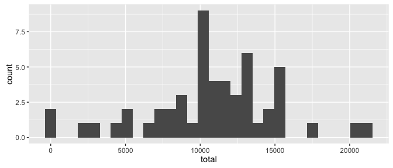
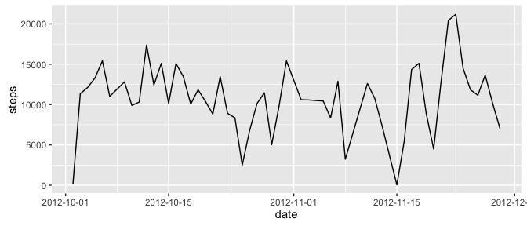
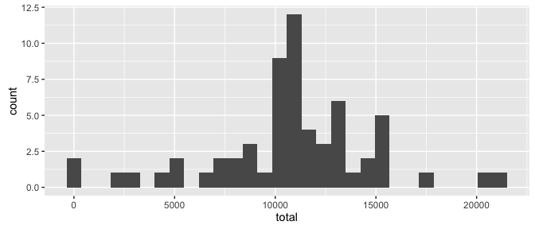
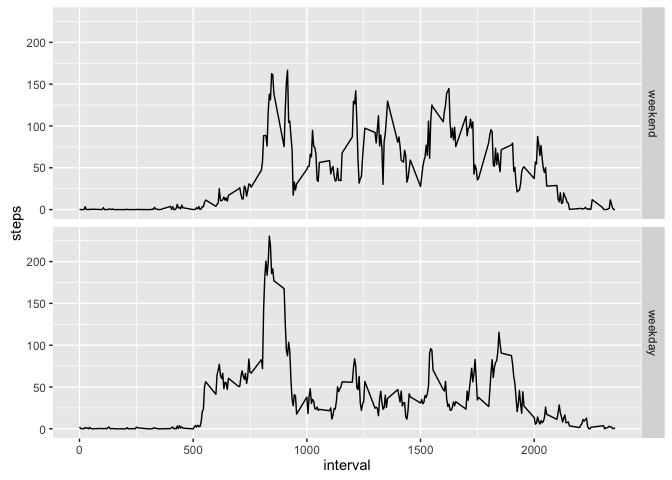

# Reproducible Research: Peer Assessment 1


## Loading and preprocessing the data
We assume that the zip file containing data was first unzip.  
We can then load data in R:


```r
activity <- read.csv("activity.csv", colClasses = c("integer", "Date", "integer"))
```

## What is mean total number of steps taken per day?
We are ignoring missing values for now.  

1. Calculate the total number of steps taken per day:


```r
library(dplyr)
library(pander)

activity <- tbl_df(activity)
totalAct <- activity %>% group_by(date) %>% summarise(total = sum(steps))

pander(data.frame(totalAct))
```


------------------
   date     total 
---------- -------
2012-10-01   NA   

2012-10-02   126  

2012-10-03  11352 

2012-10-04  12116 

2012-10-05  13294 

2012-10-06  15420 

2012-10-07  11015 

2012-10-08   NA   

2012-10-09  12811 

2012-10-10  9900  

2012-10-11  10304 

2012-10-12  17382 

2012-10-13  12426 

2012-10-14  15098 

2012-10-15  10139 

2012-10-16  15084 

2012-10-17  13452 

2012-10-18  10056 

2012-10-19  11829 

2012-10-20  10395 

2012-10-21  8821  

2012-10-22  13460 

2012-10-23  8918  

2012-10-24  8355  

2012-10-25  2492  

2012-10-26  6778  

2012-10-27  10119 

2012-10-28  11458 

2012-10-29  5018  

2012-10-30  9819  

2012-10-31  15414 

2012-11-01   NA   

2012-11-02  10600 

2012-11-03  10571 

2012-11-04   NA   

2012-11-05  10439 

2012-11-06  8334  

2012-11-07  12883 

2012-11-08  3219  

2012-11-09   NA   

2012-11-10   NA   

2012-11-11  12608 

2012-11-12  10765 

2012-11-13  7336  

2012-11-14   NA   

2012-11-15   41   

2012-11-16  5441  

2012-11-17  14339 

2012-11-18  15110 

2012-11-19  8841  

2012-11-20  4472  

2012-11-21  12787 

2012-11-22  20427 

2012-11-23  21194 

2012-11-24  14478 

2012-11-25  11834 

2012-11-26  11162 

2012-11-27  13646 

2012-11-28  10183 

2012-11-29  7047  

2012-11-30   NA   
------------------

2. If you do not understand the difference between a histogram and a barplot, research the difference between them. Make a histogram of the total number of steps taken each day:


```r
library(ggplot2)
library(scales)

ggplot(data = totalAct, aes(total)) +
    geom_histogram()
```

<!-- -->

3. Calculate and report the mean and median of the total number of steps taken per day:


```r
mean(totalAct$total, na.rm = TRUE)
```

```
## [1] 10766.19
```

```r
median(totalAct$total, na.rm = TRUE)
```

```
## [1] 10765
```

The mean of the total number of steps taken per day is 10766.  
The median of the total number of steps taken per day is 10765.

## What is the average daily activity pattern?

1. Make a time series plot (i.e. type = "l") of the 5-minute interval (x-axis) and the average number of steps taken, averaged across all days (y-axis):


```r
library(ggplot2)
library(scales)

ggplot(data = activity, aes(date, steps)) +
    stat_summary(fun.y = sum, geom = "line") +
    scale_x_date(labels = date_format())
```

<!-- -->

2. Which 5-minute interval, on average across all the days in the dataset, contains the maximum number of steps?  


```r
meanIntAct <- activity %>% 
    group_by(interval) %>% 
    mutate(meanIntSteps = mean(steps, na.rm = TRUE))

meanIntAct[which.max(meanIntAct$meanIntSteps), c("interval", "meanIntSteps")]
```

```
## Source: local data frame [1 x 2]
## Groups: interval [1]
## 
##   interval meanIntSteps
##      <int>        <dbl>
## 1      835     206.1698
```

Interval 835 has therefore the `max` average across all days: 206.

## Imputing missing values
1. Calculate and report the total number of missing values in the dataset (i.e. the total number of rows with NAs):  


```r
sum(is.na(activity$steps))
```

```
## [1] 2304
```

2. Devise a strategy for filling in all of the missing values in the dataset. The strategy does not need to be sophisticated. For example, you could use the mean/median for that day, or the mean for that 5-minute interval, etc.

Let start by investigating the use of the mean of the day to imput missing values.
If we look at days with missing values, we can easily spot that all values for these days are missing:  


```r
isNaAct <- activity %>% mutate(isNa = is.na(steps)) 
naDates <- unique(isNaAct[isNaAct$isNa, ]$date)
nrow(activity[activity$date %in% naDates && !is.na(activity$steps), ])
```

```
## [1] 0
```

Therefore this strategy cannot be put in place.  

3. Create a new dataset that is equal to the original dataset but with the missing data filled in.

The other proposed strategy consists in using the mean of each 5-minutes interval as a proxy for missing value:  


```r
getMeanIntAct <- function (d, DF) {
    DF[DF$date == d, ]$meanIntSteps
}

missingValues <- is.na(activity$steps)
imputedAct <- activity
imputedAct[missingValues, ]$steps <- 
    getMeanIntAct(imputedAct[missingValues, ]$date, meanIntAct)
```

We can check that there are no more missing values:

```r
sum(is.na(imputedAct))
```

```
## [1] 0
```

4. Make a histogram of the total number of steps taken each day and Calculate and report the mean and median total number of steps taken per day. Do these values differ from the estimates from the first part of the assignment? What is the impact of imputing missing data on the estimates of the total daily number of steps?


```r
totalImputedAct <- imputedAct %>% group_by(date) %>% summarise(total = sum(steps))

ggplot(data = totalImputedAct,
  aes(total)) +
  geom_histogram()
```

<!-- -->

The mean and median total number of steps taken per day are:  


```r
mean(totalImputedAct$total, na.rm = TRUE)
```

```
## [1] 10766.19
```

```r
median(totalImputedAct$total, na.rm = TRUE)
```

```
## [1] 10766.19
```

We can observe that the second imputing strategy had no impact on the mean.  
Futhermore, we can observe that the mean and median total number of steps taken per day are equal.

## Are there differences in activity patterns between weekdays and weekends?

1. Create a new factor variable in the dataset with two levels – "weekday" and "weekend" indicating whether a given date is a weekday or weekend day.  


```r
weekDays <- c('Lundi', 'Mardi', 'Mercredi', 'Jeudi', 'Vendredi') #Sorry in French!
imputedAct$dayType <- factor(
    (weekdays(imputedAct$date) %in% weekDays), 
    levels = c(FALSE, TRUE), 
    labels = c('weekend', 'weekday')
)
```

2. Make a panel plot containing a time series plot (i.e. type = "l") of the 5-minute interval (x-axis) and the average number of steps taken, averaged across all weekday days or weekend days (y-axis). See the README file in the GitHub repository to see an example of what this plot should look like using simulated data.


```r
ggplot(data = imputedAct, aes(interval, steps)) +
    stat_summary(fun.y = mean, geom = "line") +
    facet_grid(dayType ~ .)
```

<!-- -->

We can observe that there are differences in activity patterns between weekdays and weekends:

* During weekens, first significant intervals (between 500 and 800) have total number of steps lower than weekdays which could demonstrate that people wake up later.
* Between 1100-1900 (afternoon) weekends have higher total number of steps which could demonstrate that people make more physical activities during weekends.
